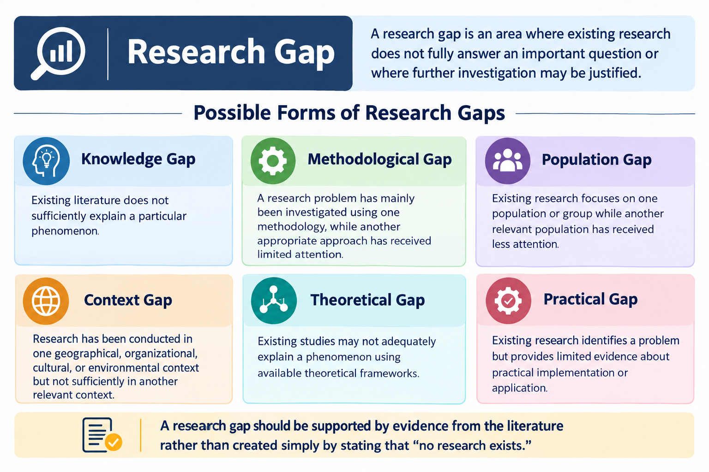

# PhD Research Topic Selection Guide

Choosing the right PhD research topic is an important early step in the research journey. A well-defined topic helps establish a clear research problem, identify relevant literature, select an appropriate methodology, and develop a meaningful research contribution.

This guide provides a practical framework for identifying, evaluating, and refining a PhD research topic.

---

## 1. What Is a PhD Research Topic?

A PhD research topic describes the specific area or problem that a researcher intends to investigate in depth.

A strong topic generally identifies:

* The research area
* The problem or phenomenon being studied
* The population, context, or environment
* The key variables or concepts, where applicable
* The scope of the research

A broad subject such as:

> Artificial Intelligence

is usually too wide for a PhD study.

A more focused topic might investigate:

> The application of explainable artificial intelligence in decision-making systems.

The final research topic should become more specific as the researcher reviews existing literature and identifies a research gap.

---

## 2. Why Is Topic Selection Important?

The research topic influences many later stages of a PhD project, including:

* Literature review
* Research questions
* Research objectives
* Research methodology
* Data collection
* Data analysis
* Thesis structure
* Publication opportunities
* Overall research contribution

A poorly defined topic can make it difficult to establish a clear research problem or determine an appropriate research methodology.

A well-defined topic provides a foundation for developing the research proposal.

---

## 3. Start With a Broad Research Area

Begin by identifying an area that interests you and is relevant to your academic discipline.

Examples include:

* Artificial Intelligence
* Machine Learning
* Data Science
* Biotechnology
* Renewable Energy
* Education
* Psychology
* Management
* Finance
* Healthcare
* Environmental Science
* Computer Science
* Social Sciences
* Engineering

At this stage, avoid trying to finalize the exact title immediately.

Start broad and gradually narrow the subject.

---

## 4. Identify a Specific Research Problem

After selecting a broad research area, identify a problem that requires further investigation.

Ask questions such as:

* What problem currently exists?
* Who is affected by the problem?
* Why is the problem important?
* What solutions have already been proposed?
* What limitations exist in current approaches?
* What remains unclear?
* What could be investigated further?

The answers can help transform a broad subject into a researchable problem.

---

## 5. Conduct a Preliminary Literature Review

Before finalizing a topic, examine existing scholarly literature.

Useful sources may include:

* Peer-reviewed journal articles
* Conference papers
* Academic books
* Systematic reviews
* Doctoral theses and dissertations
* Government publications
* Research databases
* Institutional repositories

The purpose of the preliminary literature review is not simply to collect papers.

It is to understand:

* What has already been studied
* How researchers have approached the problem
* What findings have been reported
* Where studies disagree
* What limitations researchers have identified
* What areas require additional research

---

## 6. Find the Research Gap

A research gap is an area where existing research does not fully answer an important question or where further investigation may be justified.



Possible forms of research gaps include:

### Knowledge Gap

Existing literature does not sufficiently explain a particular phenomenon.

### Methodological Gap

A research problem has mainly been investigated using one methodology, while another appropriate approach has received limited attention.

### Population Gap

Existing research focuses on one population or group while another relevant population has received less attention.

### Context Gap

Research has been conducted in one geographical, organizational, cultural, or environmental context but not sufficiently in another relevant context.

### Theoretical Gap

Existing studies may not adequately explain a phenomenon using available theoretical frameworks.

### Practical Gap

Existing research identifies a problem but provides limited evidence about practical implementation or application.

A research gap should be supported by evidence from the literature rather than created simply by stating that "no research exists."

---

## 7. Convert the Research Gap Into a Problem Statement

Once a potential gap has been identified, formulate a clear research problem.

A useful problem statement should explain:

1. What is currently known?
2. What remains unclear or insufficiently addressed?
3. Why does the issue matter?
4. What needs to be investigated?

For example:

> Existing studies have examined the use of artificial intelligence in educational environments, but limited research has investigated how explainable AI can influence trust in automated academic decision-support systems. This creates an opportunity to investigate the relationship between explainability and user trust in such systems.

The exact problem statement should be supported by relevant scholarly literature.

---

## 8. Develop Research Questions

Research questions define what the study intends to investigate.

Good research questions should be:

* Clear
* Specific
* Researchable
* Relevant to the research problem
* Consistent with the research objectives
* Appropriate for the selected methodology

For example:

> How does explainability influence user trust in AI-based academic decision-support systems?

Additional questions could examine relationships between explainability, transparency, usability, and trust.

Avoid questions that are too broad to investigate within the available time and resources.

---

## 9. Define Research Objectives

Research objectives describe what the study intends to accomplish.

Objectives commonly begin with action verbs such as:

* Examine
* Investigate
* Analyze
* Evaluate
* Compare
* Identify
* Develop
* Assess
* Explore
* Determine

Example:

### General Objective

> To investigate the influence of explainability on user trust in AI-based academic decision-support systems.

### Specific Objectives

1. To examine existing approaches to explainable AI in academic decision-support systems.
2. To identify factors that influence user trust in AI-based systems.
3. To analyze the relationship between explainability and user trust.
4. To evaluate the effectiveness of explainability approaches in improving user understanding.

The objectives should directly connect to the research questions.

---

## 10. Evaluate the Feasibility of the Topic

A topic may be academically interesting but difficult to complete if the necessary resources are unavailable.

Consider the following factors:

### Time

Can the research reasonably be completed within the available PhD period?

### Data Availability

Can the required data be obtained ethically and legally?

### Participants

If human participants are required, can an appropriate participant group be accessed?

### Resources

Do you have access to the necessary:

* Software
* Equipment
* Databases
* Laboratory facilities
* Research tools
* Computing resources

### Skills

Do you have, or can you develop, the skills required for the proposed research?

### Ethical Considerations

Could the research involve privacy, sensitive information, vulnerable participants, or other ethical concerns?

### Financial Requirements

Are the expected research costs manageable?

---

## 11. Check the Scope of the Topic

A PhD topic should be sufficiently focused to allow detailed investigation.

### Too Broad

> Artificial Intelligence in Healthcare

This covers an extremely large area.

### More Focused

> Explainable AI for Clinical Decision Support

### Further Focused

> Evaluating Explainable AI Techniques for Improving Clinician Trust in Clinical Decision-Support Systems

The appropriate level of specificity depends on the discipline, research objectives, methodology, available data, and university requirements.

---

## 12. Consider Originality and Research Contribution

A PhD should make a meaningful contribution to knowledge.

When evaluating a topic, ask:

* What is new about this research?
* Does it address an unresolved problem?
* Does it apply an existing method in a new context?
* Does it develop a new method, framework, model, or approach?
* Does it provide new empirical evidence?
* Could the findings improve understanding or practice?

Originality does not necessarily mean creating an entirely new field.

A contribution may involve new evidence, methods, applications, interpretations, theoretical development, or empirical findings.

---

## 13. Consider Your Academic and Professional Interests

Long-term interest in the subject can be valuable because PhD research requires sustained engagement with the topic.

Consider:

* Your academic background
* Previous research experience
* Technical skills
* Areas of professional interest
* Existing knowledge
* Potential future research directions

However, personal interest should be considered alongside research significance, feasibility, originality, and available evidence.

---

## 14. Check Supervisor and Institutional Expertise

Before finalizing the topic, consider whether suitable academic supervision is available.

Check whether potential supervisors have expertise related to:

* Your research area
* Your methodology
* Your theoretical framework
* Your intended research population or context

Also review your university's requirements for:

* Research proposals
* Topic approval
* Ethics approval
* Thesis structure
* Research methodology
* Progress reviews

University and department requirements may differ, so researchers should follow the applicable institutional guidelines.

---

## 15. Search for Existing Research Topics

Before selecting a final topic, search academic databases and scholarly resources using combinations of:

* Main research concept
* Research problem
* Population
* Location
* Methodology
* Application area

For example:

```text
"explainable AI" AND "user trust"

"explainable artificial intelligence" AND
"clinical decision support"

"AI transparency" AND "healthcare"

"machine learning" AND "trust" AND "decision support"
```

Review recent literature as well as influential foundational studies.

---

## 16. Use a Topic Evaluation Checklist

Use the following checklist before finalizing your topic.

| Criteria          | Questions to Ask                                                     |
| ----------------- | -------------------------------------------------------------------- |
| Research Interest | Am I genuinely interested in the subject?                            |
| Research Problem  | Is there a clearly defined problem?                                  |
| Research Gap      | Can I support the gap using literature?                              |
| Originality       | Is there a meaningful potential contribution?                        |
| Relevance         | Is the problem significant to the field?                             |
| Feasibility       | Can the study be completed with available resources?                 |
| Data              | Can appropriate data be obtained?                                    |
| Methodology       | Is an appropriate research method available?                         |
| Ethics            | Can the study be conducted ethically?                                |
| Scope             | Is the topic neither too broad nor too narrow?                       |
| Supervision       | Is suitable academic expertise available?                            |
| Time              | Can the project be completed within the required period?             |
| Publication       | Could the findings potentially contribute to scholarly publications? |

---

## 17. Common Mistakes When Choosing a PhD Topic

### Choosing a Topic That Is Too Broad

A broad subject can result in an unmanageable research project.

### Choosing a Topic Only Because It Is Popular

A popular research area does not automatically provide a suitable research problem.

### Ignoring Existing Literature

Without reviewing previous research, it is difficult to establish originality and identify a genuine research gap.

### Selecting a Topic Without Considering Data

A promising research question may become impractical if the necessary data cannot be obtained.

### Making the Topic Too Narrow

A topic that is excessively narrow may not provide sufficient scope for a substantial research contribution.

### Focusing Only on the Title

The title is important, but the underlying research problem, questions, objectives, methodology, and contribution are more fundamental.

### Claiming "No One Has Studied This"

Such claims should be made cautiously. A literature search may reveal related research that needs to be acknowledged.

---

## 18. Example: From Subject to PhD Topic

The topic-selection process can be viewed as a series of steps:

```text
Broad Subject
      ↓
Research Area
      ↓
Research Problem
      ↓
Literature Review
      ↓
Research Gap
      ↓
Problem Statement
      ↓
Research Questions
      ↓
Research Objectives
      ↓
Research Methodology
      ↓
Focused Research Topic
```

### Example

**Broad subject:**

> Artificial Intelligence

**Research area:**

> Explainable Artificial Intelligence

**Potential problem:**

> Users may have difficulty understanding decisions produced by complex AI systems.

**Potential research gap:**

> Existing research may not sufficiently examine explainability and user trust within a specific application context.

**Research question:**

> How does explainability influence user trust in AI-based decision-support systems?

**Potential topic:**

> Evaluating the Influence of Explainable Artificial Intelligence on User Trust in Decision-Support Systems

The final topic should be refined after reviewing the literature and discussing the research proposal with the relevant academic supervisor.

---

## 19. How to Refine a Research Topic

A research topic can be refined by adding relevant dimensions such as:

### Population

Who is being studied?

### Context

Where or in what environment is the research conducted?

### Variables

What concepts or variables are being examined?

### Method

What research approach will be used?

### Outcome

What phenomenon or outcome will be investigated?

For example:

> AI

can become:

> Explainable AI

then:

> Explainable AI in Healthcare

then:

> Explainable AI for Clinical Decision Support

and eventually:

> Evaluating the Influence of Explainability on Clinician Trust in AI-Based Clinical Decision-Support Systems

The final wording should accurately reflect the actual study rather than attempting to include unnecessary keywords.

---

## 20. Research Topic Selection Template

Use the following template to develop a potential PhD topic:

**Broad Research Area:**
[Enter research area]

**Research Problem:**
[Describe the problem]

**Target Population or Context:**
[Identify the population or research setting]

**Existing Research:**
[Summarize important findings from the literature]

**Research Gap:**
[Explain what remains insufficiently addressed]

**Research Question:**
[Write the primary research question]

**Research Objectives:**

1. [Objective 1]
2. [Objective 2]
3. [Objective 3]

**Potential Contribution:**
[Explain what the research may contribute]

**Proposed Methodology:**
[Qualitative / Quantitative / Mixed Methods / Experimental / Other]

**Data Availability:**
[Explain how relevant data may be obtained]

**Ethical Considerations:**
[Identify important ethical requirements]

**Proposed Research Topic:**
[Write the refined topic]

---

## 21. Final Checklist

Before submitting a proposed PhD research topic, ask:

* [ ] Is the research problem clearly defined?
* [ ] Have I reviewed relevant literature?
* [ ] Can I identify and support a research gap?
* [ ] Are the research questions clear?
* [ ] Are the objectives aligned with the questions?
* [ ] Is the topic sufficiently focused?
* [ ] Is the research feasible?
* [ ] Can the required data be accessed?
* [ ] Have ethical considerations been considered?
* [ ] Is there potential for a meaningful research contribution?
* [ ] Does the topic align with my academic discipline?
* [ ] Does it meet my university's research requirements?
* [ ] Have I discussed the topic with an appropriate academic supervisor?

---

## About Suhi Research Solutions

**Suhi Research Solutions** provides research assistance and academic guidance for scholars and researchers.

Areas of support include:

* PhD research assistance
* Research topic selection
* Research methodology guidance
* Thesis and dissertation support
* Data analysis
* Academic publication support
* Research consultation
* Research ethics and integrity guidance

Website:
https://www.suhiresearchsolutions.com/

---

## Disclaimer

This guide provides general educational information about PhD research topic selection. Research requirements, proposal formats, ethical procedures, and thesis guidelines vary between universities, disciplines, and institutions.

Researchers should follow the official requirements of their university, department, research supervisor, and relevant ethics committee.

---

**Maintained by Suhi Research Solutions**
